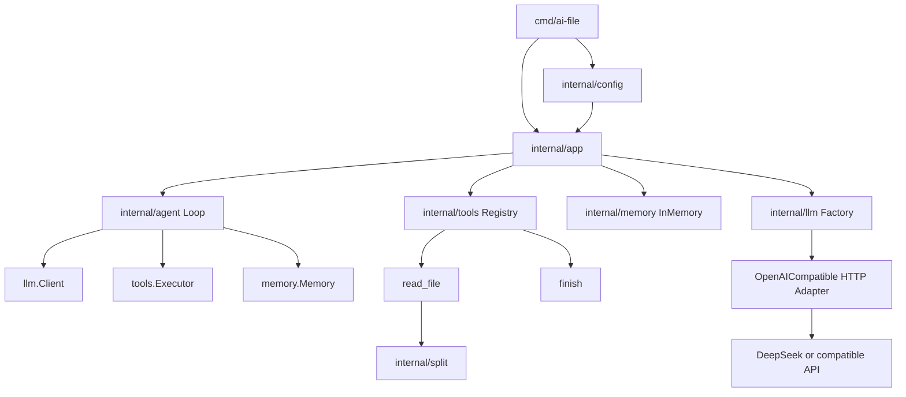

# 文件内容分析 Agent v1.0.0 技术方案

**状态**：待评审
**依据**：[产品需求文档](prd/prdv1.0.0.md)（v1.1）
**目标**：为后续 Go 编码提供唯一的技术实施依据；不引入 Agent 框架、向量库或厂家 SDK。

---

## 1. 范围与设计原则

实现一个本地单进程 CLI：读取一个 UTF-8 文本文件，按空行确定性切段，交由大模型逐段提炼，并以编号列表输出。

### 1.1 必须满足

- Go 1.22+，单二进制、无 CGO。
- 核心链路必须是 `Goal → LLM → Tool → Observation → Memory → LLM` 的 ReAct Loop。
- 工具、记忆、LLM 相互隔离；Loop 不得硬编码 `read_file`、DeepSeek 或任何厂商协议。
- v1 只支持 OpenAI 兼容 Chat Completions 的 tool calling；默认 DeepSeek `deepseek-v4-pro`。
- 仅进程内 Memory；不使用 embedding、向量检索或外部数据库。
- 除 YAML 解析外优先使用 Go 标准库；唯一允许的第三方依赖为 `gopkg.in/yaml.v3`。

### 1.2 关键技术决策

| 决策 | 选择 | 原因 |
|---|---|---|
| 文件预检 | `app` 层在进入 Loop 前预检并切段 | 空文件无需调用 LLM；输入错误可稳定映射退出码 2 |
| 空文件 | 配置校验通过后直接输出 `段数: 0`、`无有效段落`，退出 0 | 不需要让模型调用 `finish([])`，减少无效成本 |
| LLM 实现 | 自有 DTO + `llm.Client`，OpenAI-compatible HTTP Adapter | 换同协议厂商只改配置；业务层无 SDK 耦合 |
| 工具错误 | 作为 `error: ...` Observation 返回模型，非致命 Go error | 模型可修正参数并继续下一轮 |
| HTTP 重试 | 仅 429、5xx、网络临时错误；最多 2 次重试（共 3 次请求） | 避免对鉴权/参数错误做无效重试 |
| `-out` | 仅成功生成完整结果后写入 | 与「失败不输出半成品」保持一致 |

---

## 2. 总体架构



### 2.1 依赖规则

```text
cmd/ai-file → app, config
app         → agent, llm, tools, memory, split, config
agent       → llm（DTO 与 Client 接口）, tools.Executor, memory.Memory
tools       → llm（ToolSpec）, memory.Memory, split
memory      → llm（Message DTO）
llm         → net/http, encoding/json
split       → 无业务依赖
```

禁止依赖：

- `agent`、`tools`、`memory` 不得导入 `llm/openaicompat` 或任何厂商 SDK。
- `tools` 不得导入 `agent`。
- 任意 `internal` 包不得导入 `cmd`。

---

## 3. 工程结构

```text
.
├── cmd/ai-file/main.go
├── internal/
│   ├── app/run.go
│   ├── config/
│   │   ├── config.go
│   │   ├── defaults.go
│   │   └── load.go
│   ├── agent/
│   │   ├── goal.go
│   │   ├── loop.go
│   │   ├── prompt.go
│   │   └── render.go
│   ├── llm/
│   │   ├── types.go
│   │   ├── client.go
│   │   ├── factory.go
│   │   └── openaicompat/client.go
│   ├── memory/
│   │   ├── memory.go
│   │   └── inmem.go
│   ├── split/split.go
│   └── tools/
│       ├── tool.go
│       ├── registry.go
│       ├── read_file.go
│       └── finish.go
├── go.mod
├── go.sum
└── ai-file.yaml.example
```

| 文件/包 | 唯一职责 |
|---|---|
| `cmd/ai-file/main.go` | 解析 flag，调用 `app.Run`，将领域错误转为进程退出码 |
| `app/run.go` | 组合根：预检目标文件、组装 Memory/Registry/LLM/Agent、管理 stdout/stderr |
| `config` | 默认值、YAML/环境变量/flag 合并、配置校验 |
| `agent` | Goal、系统提示、ReAct 控制流、最终渲染 |
| `llm` | 厂家无关类型与接口、Provider 预设、HTTP 协议适配 |
| `memory` | 本轮会话消息与 KV 工作状态 |
| `split` | 空行分段纯函数 |
| `tools` | Tool 契约、注册表及两个内置工具 |

---

## 4. 核心接口与数据模型

以下是实现时必须保持的业务接口；字段可增加，但不得把厂商 SDK 类型泄漏到接口中。

### 4.1 LLM DTO 与接口

```go
package llm

type Role string

const (
    RoleSystem    Role = "system"
    RoleUser      Role = "user"
    RoleAssistant Role = "assistant"
    RoleTool      Role = "tool"
)

type Message struct {
    Role       Role
    Content    string
    ToolCallID string
    ToolCalls  []ToolCall
}

type ToolCall struct {
    ID            string
    Name          string
    ArgumentsJSON string
}

type ToolSpec struct {
    Name        string
    Description string
    InputSchema json.RawMessage
}

type ChatRequest struct {
    Messages []Message
    Tools    []ToolSpec
    Model    string
}

type ChatResponse struct {
    Content      string
    ToolCalls    []ToolCall
    FinishReason string
}

type Client interface {
    Chat(ctx context.Context, request ChatRequest) (ChatResponse, error)
}
```

`Message` 是 Memory 和 LLM 的共同数据契约。工具执行结果必须写作 `RoleTool`，并携带触发它的 `ToolCallID`。

### 4.2 Memory

```go
type Memory interface {
    Append(message llm.Message) error
    Messages() []llm.Message
    Set(key, value string)
    Get(key string) (string, bool)
    Clear()
}
```

`Messages()` 必须返回拷贝，避免调用方篡改历史。实现使用 `[]llm.Message` 与 `map[string]string`；v1 Loop 单线程，不为并发引入锁。

固定 KV 键：

| 键 | 写入方 | 用途 |
|---|---|---|
| `goal_path` | `app` | 被允许读取的规范化绝对路径 |
| `paragraph_count` | `read_file` | `finish` 校验条数 |
| `read_file_observation` | `read_file` | 同一路径重复调用的缓存 |

追加前若 tool Observation 超过 32KiB，则只保留前 32KiB 并追加 `\n[observation truncated]`。这是 Memory 限制，不影响 `read_file` 的原始切段过程。

### 4.3 Tool 与 Registry

```go
type Tool interface {
    Name() string
    Description() string
    InputSchema() json.RawMessage
    Execute(ctx context.Context, argumentsJSON string) (string, error)
}

type Executor interface {
    List() []llm.ToolSpec
    Execute(ctx context.Context, name, argumentsJSON string) (string, error)
    Completion() (items []string, ok bool)
}

type Registry struct { /* 私有工具表 */ }

func (r *Registry) Register(tool Tool) error
func (r *Registry) List() []llm.ToolSpec
func (r *Registry) Execute(
    ctx context.Context,
    name string,
    argumentsJSON string,
) (string, error)
func (r *Registry) Completion() (items []string, ok bool)
```

- `Register` 遇到重名直接返回错误；应用启动失败。
- `Execute` 找不到工具时返回 `unknown tool "<name>"`。
- `finish` 成功后，Registry 保存其结构化 `items`；`Completion` 返回拷贝。Loop 只检查通用的 `Completion`，不解析文本 Observation，也不识别 `finish` 工具名。
- Loop 只依赖 `Executor`，测试可注入 fake executor。

### 4.4 Agent

```go
type Loop struct {
    Client   llm.Client
    Tools    tools.Executor
    Memory   memory.Memory
    MaxSteps int
    Verbose  io.Writer
}

type Result struct {
    Items []string
}

func (l *Loop) Run(ctx context.Context) (Result, error)
```

`Result` 只在 `finish` 成功时返回。模型错误、工具错误或超过轮次均不返回可渲染的半成品。

---

## 5. 文件预检、切段与 Tool 行为

### 5.1 应用预检

`app.Run` 解析用户路径为绝对路径，随后按以下顺序处理：

1. `os.Stat`：不存在、不是普通文件 → 输入错误（exit 2）。
2. 检查大小 ≤ `max_bytes`，否则 exit 2。
3. 读取字节；发现 `0x00` 或 `utf8.Valid` 为 false → exit 2。
4. 调用 `split.Paragraphs`。若 0 段，直接渲染空结果、exit 0（CLI 已先完成 API Key 等配置校验）。
5. 将绝对路径写入 Memory `goal_path`，进入 Agent Loop。

预检只验证任务目标，不把文件正文预先加入 LLM Memory；LLM 必须通过 `read_file` 得到内容。

### 5.2 确定性切段

`split.Paragraphs(content string) []string`：

1. 统一 `\r\n` / `\r` 到 `\n`。
2. 以“仅含空白字符的一行或连续多行”切分。
3. 对每个块使用 `strings.TrimSpace`；空块丢弃。
4. 未出现空行时，非空全文是一段。

此函数没有文件 I/O、配置或 LLM 依赖，因此可表驱动测试。

### 5.3 `read_file`

参数 Schema：

```json
{
  "type": "object",
  "additionalProperties": false,
  "required": ["path"],
  "properties": {
    "path": { "type": "string", "description": "待读取的目标文件路径" }
  }
}
```

执行规则：

1. 解析 JSON，缺失或空 `path` 返回 `error: path is required`。
2. 将参数规范化为绝对路径；与 `Memory["goal_path"]` 不同则返回 `error: path not allowed`。
3. 若已有 `read_file_observation`，直接返回缓存。
4. 读文件并调用 `split.Paragraphs`；每段超过 `max_para_chars` 时按 rune 截断，并追加 `\n[truncated]`。
5. 写入 `paragraph_count` 和 `read_file_observation`，返回下列 Observation。

```text
path: /absolute/path
paragraph_count: 2
paragraphs:
[1] 第一段全文
[2] 第二段全文
```

### 5.4 `finish`

参数 Schema：

```json
{
  "type": "object",
  "additionalProperties": false,
  "required": ["items"],
  "properties": {
    "items": {
      "type": "array",
      "items": { "type": "string", "minLength": 1 }
    }
  }
}
```

执行规则：

- 还没有 `paragraph_count`：返回 `error: read_file must succeed before finish`。
- `items` 数量不等于段数：返回 `error: item count X does not match paragraph count Y`。
- 成功时返回内部完成标记；由 Loop 取出 `items` 并结束。该标记不应成为用户 stdout。

同一轮中按模型返回的顺序串行调用工具。若 `finish` 在 `read_file` 前，它会失败并作为 Observation 写回，下一轮由模型修正。

---

## 6. ReAct 运行流程

### 6.1 Goal 与系统提示

`Goal` 在 `app` 创建后不可变，其中含绝对路径。系统消息语义必须包含：

```text
目标：读取指定文件并按空行段落逐段总结。
必须先调用 read_file 获取内容；不得猜测正文。
得到段落后，每段用一句最精炼的话归纳核心，按原顺序填入 finish.items。
finish.items 的数量必须与 paragraph_count 完全相等。
禁止编造信息、复述长段落或输出最终答案到普通文本。
```

### 6.2 时序

```mermaid
sequenceDiagram
    participant App
    participant Loop
    participant LLM
    participant Registry
    participant Memory

    App->>Memory: 写入 system Goal
    loop maxSteps 次以内
        Loop->>LLM: Chat(messages, tools)
        LLM-->>Loop: content + tool_calls
        Loop->>Memory: 追加 assistant 消息
        alt 无 tool_calls
            Loop->>Memory: 追加纠偏 user 消息
        else 有 tool_calls
            loop 每个 ToolCall，按顺序
                Loop->>Registry: Execute(name, arguments)
                Registry-->>Loop: observation
                Loop->>Memory: 追加 tool 消息
            end
            alt finish 校验成功
                Loop-->>App: Result(items)
            end
        end
    end
```

### 6.3 Loop 伪代码

```go
for step := 1; step <= maxSteps; step++ {
    response, err := client.Chat(ctx, llm.ChatRequest{
        Messages: memory.Messages(),
        Tools:    tools.List(),
        Model:    model,
    })
    if err != nil {
        return Result{}, fmt.Errorf("LLM chat: %w", err)
    }

    memory.Append(llm.Message{
        Role:      llm.RoleAssistant,
        Content:   response.Content,
        ToolCalls: response.ToolCalls,
    })
    verbose.Write(step, response)

    if len(response.ToolCalls) == 0 {
        memory.Append(llm.Message{
            Role:    llm.RoleUser,
            Content: "必须调用工具或 finish，继续完成目标。",
        })
        continue
    }

    for _, call := range response.ToolCalls {
        observation, err := tools.Execute(ctx, call.Name, call.ArgumentsJSON)
        if err != nil {
            observation = "error: " + err.Error()
        }
        memory.Append(llm.Message{
            Role:       llm.RoleTool,
            Content:    limitObservation(observation),
            ToolCallID: call.ID,
        })
        if items, ok := tools.Completion(); ok {
            return Result{Items: items}, nil
        }
    }
}
return Result{}, ErrMaxSteps
```

`finish` 的成功结果不依赖解析人类字符串。Registry 通过 `Completion()` 将 `items` 结构化地交给 Loop；写入 Memory 的内容仍是简洁 Observation，例如 `finish accepted`。

### 6.4 日志

`-verbose` 仅写入 stderr，每步格式包括：

```text
step=1 thought="..."
step=1 action=read_file arguments={"path":"..."}
step=1 observation="path: ...\nparagraph_count: 2..."
```

- Thought 为空则写 `(empty)`。
- Observation 最多输出前 2KiB。
- API Key 必须脱敏；日志和错误中不得含完整 Key。

---

## 7. LLM Provider 与 HTTP Adapter

### 7.1 配置后的 Provider 预设

| Provider | Base URL | 默认模型 | 协议 |
|---|---|---|---|
| `deepseek`（默认） | `https://api.deepseek.com` | `deepseek-v4-pro` | OpenAI-compatible |
| `openai` | `https://api.openai.com/v1` | 必填 | OpenAI-compatible |
| `custom` | 必填 | 必填 | OpenAI-compatible |

`llm.New(config)` 先应用 Provider 预设，再创建一个 `openaicompat.Client`。三个 Provider 共用同一个 HTTP 实现，不创建名字不同但行为重复的 Adapter。

端点构造规则：`strings.TrimRight(baseURL, "/") + "/chat/completions"`。因此 DeepSeek 预设不补 `/v1`，OpenAI 预设自带 `/v1`，两者均可正确生成请求 URL。

### 7.2 请求映射

```json
{
  "model": "deepseek-v4-pro",
  "messages": [
    { "role": "system", "content": "..." },
    { "role": "assistant", "content": "", "tool_calls": [] },
    { "role": "tool", "tool_call_id": "call_1", "content": "..." }
  ],
  "tools": [
    {
      "type": "function",
      "function": {
        "name": "read_file",
        "description": "...",
        "parameters": {}
      }
    }
  ],
  "tool_choice": "auto",
  "stream": false
}
```

Adapter 只负责 wire format 的编码/解码，转换为 `llm.ChatResponse` 后立即丢弃厂商响应类型。DeepSeek 的 `thinking`、`reasoning_effort` 等非通用字段 v1 不发送；避免模型思考模式与 ReAct 控制流混杂。

### 7.3 超时、重试和错误

- 每次 `Chat` 通过 `context.WithTimeout(ctx, 60*time.Second)` 执行。
- 最多 2 次重试，即一次请求最多尝试 3 次。
- 可重试：网络临时错误、超时、HTTP 429、HTTP 5xx。
- 不可重试：除 429 外的 HTTP 4xx、JSON 无法解析、响应无 choices。
- 重试使用指数退避：500ms、1s；尊重 `Retry-After`（若有且不超过 30 秒）。
- 错误包装包含状态码和最多 1KiB 的响应摘要；过滤 Authorization 值与 API Key。

---

## 8. 配置、CLI 和退出码

### 8.1 配置合并

优先级由低到高：

```text
内置默认值 → Provider 预设 → ./ai-file.yaml
→ $HOME/.ai-file.yaml（仅当前者不存在） → AI_FILE_* 环境变量 → CLI flags
```

YAML 字段：

```yaml
provider: deepseek
api_key: ""             # 推荐改用 AI_FILE_API_KEY，禁止提交真实 Key
base_url: https://api.deepseek.com
model: deepseek-v4-pro
max_steps: 8
max_bytes: 524288
max_para_chars: 8000
```

CLI：

```text
ai-file [-provider value] [-base-url value] [-model value] [-verbose] [-out path] <文件路径>
```

`api_key` 不提供 flag，避免被 shell history 暴露。`AI_FILE_API_KEY` 或本地 YAML 必须提供。配置文件不存在不是错误；YAML 解析失败、未知 Provider、无 Key、`custom` 缺 URL/模型都是启动错误。

### 8.2 退出码

| 退出码 | 类别 | 示例 |
|---|---|---|
| 0 | 成功 | 产生完整摘要；或有效空文件 |
| 1 | 运行失败 | LLM 失败、超轮次、`-out` 写入失败、内部错误 |
| 2 | 输入/配置错误 | 路径无效、目录、大小超限、非 UTF-8、配置不合法 |

成功时结果只写 stdout；诊断只写 stderr。失败时不得输出摘要或写 `-out`。

---

## 9. 输出渲染

`agent.Render(path string, result Result) string` 是纯函数。

非空结果：

```text
文件: /absolute/path
段数: 2

1. 第一段的核心内容
2. 第二段的核心内容
```

空结果：

```text
文件: /absolute/path
段数: 0

无有效段落
```

如果 `read_file` 对某段添加了 `[truncated]`，该段对应输出要点必须加前缀 `[截断]`。截断状态应在 Tool 中以单独的 `truncated_paragraphs` KV（例如逗号分隔编号）保存，渲染阶段不从模型文案猜测。

---

## 10. 安全边界

1. 唯一文件权限：预检与 `read_file` 均使用 `filepath.EvalSymlinks` 得到规范路径；工具参数解析后的规范路径必须等于 `goal_path`。因此用户可指定软链，但模型不能借软链读取其他文件。
2. 只读：不注册写文件、执行命令或网络抓取工具。
3. API Key：不进入 Memory、stdout、verbose、错误文本或仓库示例文件；示例只写空值。
4. 内容外发：用户主动指定的文件正文会发送给所配置的 LLM Provider。CLI 的 `-verbose` 文档需明确这点。
5. 限制：默认最大文件 512KiB、单 Observation 32KiB、最大 8 步，防止异常输入和模型循环扩大成本。

---

## 11. 测试策略与 PRD 验收映射

默认测试不得请求真实 DeepSeek。真实联调仅做手动命令或使用 `integration` build tag。

| 层级 | 覆盖内容 | 技术手段 |
|---|---|---|
| `split` 单测 | 空文件、空行、多连续空行、CRLF、trim、无空行 | 表驱动 `testing` |
| `memory` 单测 | 消息顺序、拷贝隔离、KV、32KiB 截断 | `testing` |
| `tools` 单测 | Registry 重名/未知；路径逃逸；NUL；截断；`finish` 条数 | `t.TempDir()` + fake Memory |
| `agent` 单测 | read→finish；finish 失败后继续；无 tool_call 纠偏；超轮次 | 脚本化 fake `llm.Client` / fake `Executor` |
| `config` 单测 | 默认、Provider、YAML/env/flag 覆盖、非法配置 | `t.Setenv` + 临时 YAML |
| `openaicompat` 合约测试 | URL、请求 JSON、Bearer 头、tool calls、重试、错误脱敏 | `httptest.Server` |
| `app` 集成测试 | stdout/stderr、空文件短路、退出码、`-out` | fake Client + 临时文件 |

### 11.1 验收映射

| PRD 验收 | 测试落点 |
|---|---|
| AC1 / AC2 | `app` + fake LLM，验证段数与编号顺序 |
| AC3 | `app` 空文件短路，不创建 Client 请求 |
| AC4 | `app` 路径预检映射 exit 2 |
| AC5 | Loop 注入 bytes.Buffer，断言 `read_file` / `finish` Action |
| AC6 | Loop fake 响应先给错误 `finish`，再给正确 `finish` |
| AC7 | Registry 未注册 `read_file` 时，Loop 无法走金路径 |
| AC8 | `agent` 测试只导入 `llm.Client`，不依赖 Adapter |
| AC9 | `custom` 配置实例化同一 OpenAI-compatible Client |
| AC10 | factory 单测断言 DeepSeek URL 与 `deepseek-v4-pro` |

建议最终检查命令：

```bash
gofmt -w .
go vet ./...
go test ./...
go build ./cmd/ai-file
```

真实联调（不纳入 CI）：

```bash
export AI_FILE_API_KEY='...'
go run ./cmd/ai-file ./docs/first-project-desc.md
```

---

## 12. 实施阶段与完成定义

### 阶段 1：基础与输入边界

- 初始化 `go.mod`，实现配置加载、路径预检、切段、渲染及 CLI。
- 完成后：空文件、非法路径、分段行为均无需 LLM 即可测试。

### 阶段 2：Agent 核心

- 实现 DTO、Memory、Tool Registry、`read_file`、`finish` 和 fake LLM 驱动的 Loop。
- 完成后：单元测试可以证明 `read_file → finish`，且 Loop 不知道工具实现。

### 阶段 3：LLM 适配

- 实现 Factory 与 OpenAI-compatible HTTP Client，完成 `httptest` 协议测试、超时和重试。
- 完成后：DeepSeek 预设与 custom 配置均通过同一 Adapter。

### 阶段 4：端到端验证

- 实现 stdout/stderr、`-verbose`、`-out`，运行全量静态检查与测试。
- 使用 DeepSeek `deepseek-v4-pro` 对非敏感样例文档手动联调。

---

## 13. 后续扩展边界

v1 不实现，但当前抽象允许在不改 Loop 的情况下扩展：

- 新工具：实现 `Tool` 后注册，例如 `list_dir`、`search_in_file`。
- 新协议厂家：在 `internal/llm` 增加 Adapter，实现 `llm.Client`，注册 Provider 工厂。
- 目录/多文件：由新的 Tool 提供候选文件，不改变单次 Tool-call / Observation 机制。
- embedding：仅在出现跨文件语义检索、历史召回等明确需求时引入；届时应新建检索模块，不能污染 v1 Memory 接口。
